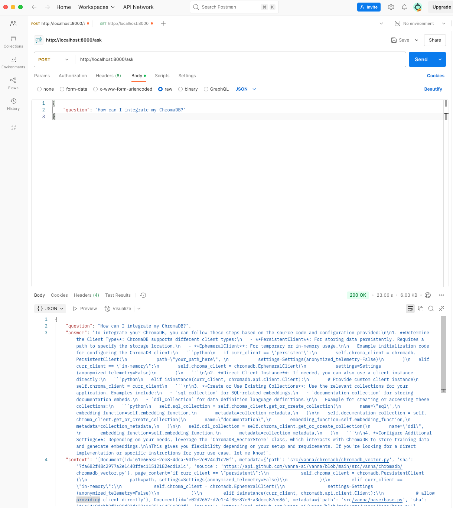
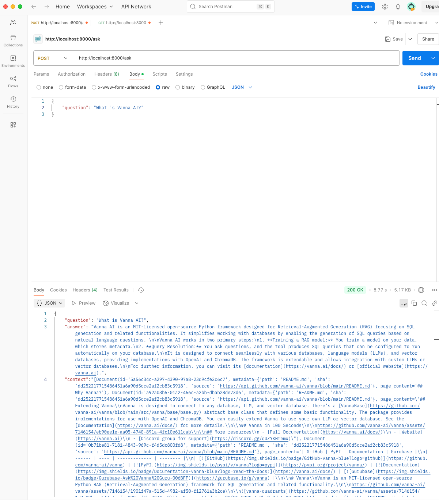
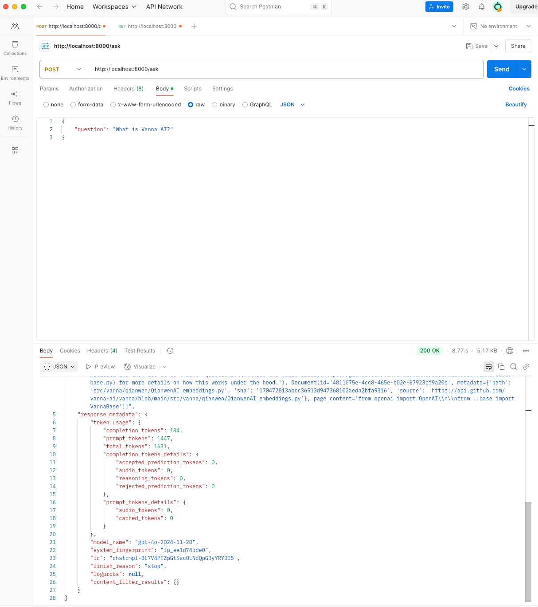
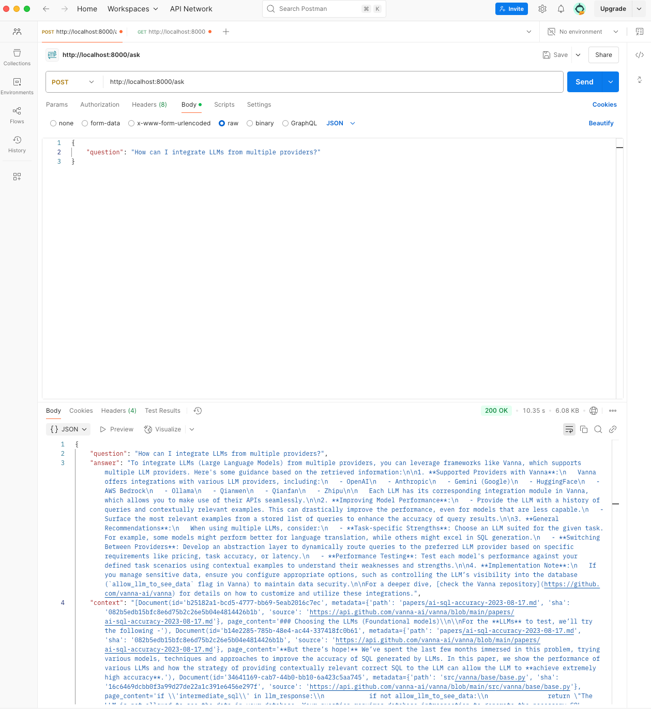
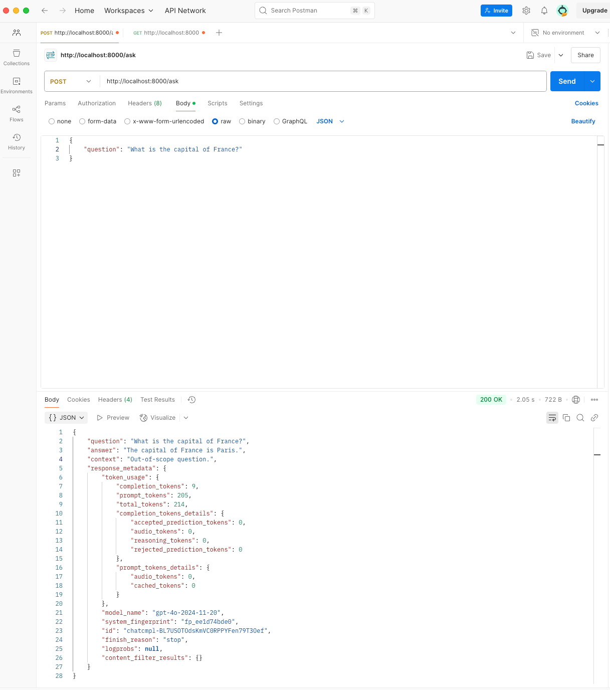
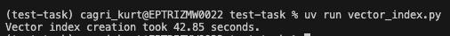

# Test Task for Querying Vana Project

This repository is built for connecting to Vanna project and querying the project information and codebase. Question-answering takes roughly 8-9 seconds depending on the question and answer length. Chroma is selected for this project because of its simplicity and flexibility to work on local environments. For vectorization, 'text-embedding-3-small' by OpenAI is selected because of its performance and reduced cost for creating embeddings. GPT-4o is used for the chat. LangChain and LangGraph are used for the agent development. UV is chosen as the package manager.

## Table of Contents
- [Prerequisites](#prerequisites)
- [Setup](#setup)
- [Screenshots](#screenshots)

## Prerequisites

Make sure you have the following tools installed:
- [Docker Desktop](https://www.docker.com/products/docker-desktop/)
- Connected to EPAM VPN via GlobalProtect.

## Setup

1. Create a .env file inside the repo with the help of the .env.example file. Fill in the necessary credentials. GITHUB_ACCESS_TOKEN is used for getting Vana repo content. It is not necessary to run the application.

2. Make sure Docker Desktop is running.

3. Create the docker image with the following command:
    ```sh
    docker build -t mbtiitsm-test-task:latest .
    ```
    Vector DB is located in the repo folder, so I will be copied into the image as well. No worries for indexing.

4. Start the container and map the ports to access it locally:
    ```sh
    docker run -p 8000:8000 mbtiitsm-test-task:latest
    ````

5. Test the application with the 'http://localhost:8000' address. To ask questions, you should send POST requests to the 'http://localhost:8000/ask' address with a JSON body:
```json
{
    "question": "What is Vanna AI?"
}
```

6. <b>(Optional)</b> If you want to test the vector database creation steps, make sure you have installed all the requirements in the pyproject.toml in your machine via 'uv' or 'pip'. Then you can run the 'vector_index.py' script with one of the following commands:
    ```sh
    python vector_index.py
    ```
    ```sh
    uv run vector_index.py
    ```

## Screenshots
### Vana-related Questions





### Out-of-scope Questions



### Vector Index Creation Time

